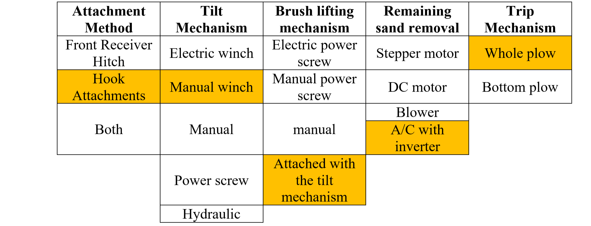

+++
title = "Concept Development"
date = 2022-01-16T12:26:22+03:00
weight = 3
+++

## Customer Needs 
Since governments with desert climates were considered to be the primary market, an interview was done with an engineer from the ministry of public works to get the customer needs, including the following :
| Customer statement | Interpreted need |
| ------:| -----------:|
| أن يكون التدعيم قوى/منتج مصنوع من مادة | Rigid structure |
|أن تكون الشفرة بشكل مائل لإزاحة الرمال لجانب الطريق |  Designed to slide the sand to the road shoulder |
| أن يحتوي على بروشات في خلف الصحيفة | Brushes attached behind plow |
|  أن يمكن تركيبه من شخص واحد/سهل الفك و التركيب| Easy to attach and detach |
| ان يمكن ان تؤدي عملية تنظيف الشارع ب مفردك و بأمان | Safe to use|
| صيانة قليلة | Low maintenance (few parts, few consumable parts) |

## Initial Design Concept
The initial design for the project started from the snow plow and it had been modified such that it
can be used for sand removal as it was be more appropriate to start where others stopped.

## Concept Generation & Selection
The team listed all necessary functions of the product in order to generate
concepts that could achieve these functions. A structured approach was made to
make for a more effective decision on the final concept. All the concepts that were generated went
through a concept screening and scoring method to obtain the relatively best concept. The table below shows the final concept selected for the project.

