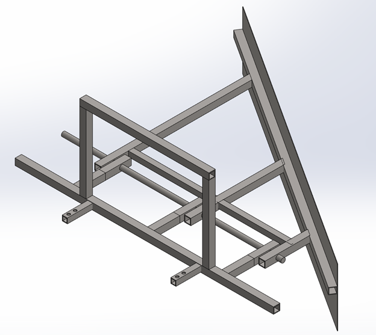
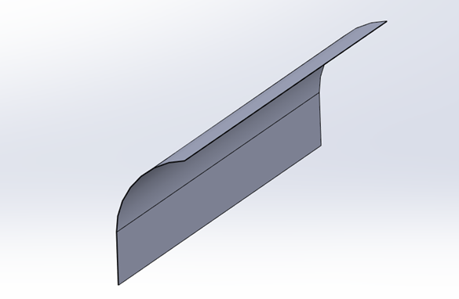
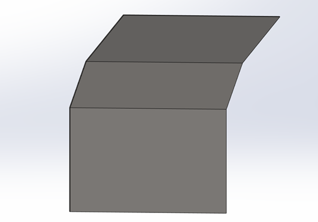
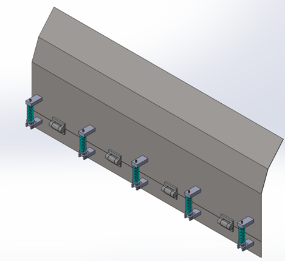
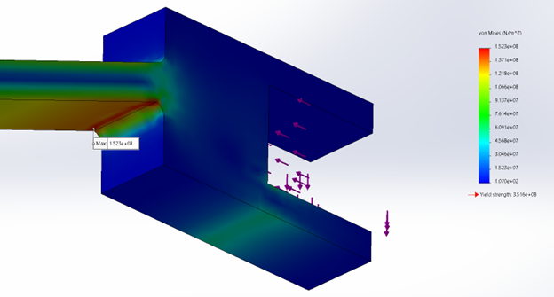

+++
title = "Detailed Design"
date = 2022-01-16T12:26:22+03:00
weight = 4
+++

## Feasibility
We started with the initial design shown below to ensure the feasibility of the project. The material used in our analysis is Steel AISI 1020, and the study was based on the worst scenario: no tires to curry the frame and the car attachment carries all loads. Therefore, all stresses were obtained are the von misses stress.

There were two loads in the feasibility study, the gravity and the frame weight caused the first load, and the second load is sand Pushing.

It was found that the maximum von mises stresses were on the plow hinges and the car mounting (front hitch). Hence, these locations must be supported. The factor of safety was 1.787; hence, the maximum load is 37527N. So, this tool is overdesigned, and the thickness of the beams needs to be decreased. The table below summarizes the results.
|Quantity|Value|
|--------|-----|
|Applied Load|21,000 N|
|FOS|1.787|
|Maximum Load|37,527 N > 3825 Kg (Small elephant)|

## Changing to Smaller Dimensions
As seen in the previous section, the system was overdesigned, with a very high beams thickness and weight. Also, the last beam dimensions do not meet the stock beams available in the market.

A list of all the available beams in the stock has been obtained from the HADIDCO company. All beams in the frame were changed to meet the stocks. Also, the plow hinges were removed, and the plow was welded to the frame directly. By doing this step, the team gets rid of the plow stresses in the previous section. The disturbed load was decreased to 7000N, and the team made many iterations until the best size was reached. The last iteration size was 50mmx50mmx5mm.

The results of the stress analysis after changing the dimensions show that the maximum stress was 185.5 [MPa], and the bearing stress of the cylinder allowed the half front of the frame to rotate. However, the stress still does not exceed the maximum allowable stress, and the safety factor is perfect and equal to 1.9; hence, the last iteration's thickness is suitable.

## Adding a Third Bar
The safety factor in the last iteration is only suitable for static loading; however, in this case, the load is dynamic, and the car's acceleration significantly impacts the system. The load could be higher than the static load if the acceleration were high; therefore, the team decided to add a third bar in the middle to double the safety factor.

A third bar in the middle was added with the same size as the other bars, and the safety factor increased dramatically from 1.9 to 6.3. This change will ensure that the dynamic load will not break the frame at its stress concentrations.

## Changing the Plow Shape
The plow was designed to be curved on the half top since the sands will start to accumulate and build up, and if there is no curvature, the sands will cross the plow from the top. The analysis of this shape takes much time due to the mesh complexity; more than one day is needed to analyze the system when this plow is used.

The team decided to simplify the curvature and make it double angled. The first angle is 20 degrees, and the second one is 40 degrees. The analysis ran successfully after this simplification.

## Plow Edge Mechanism 
The figure below shows that the plow edge mechanism consists of a spring, rod, rotating cylinder, and screws. When a certain amount of force (it depends on how much the spring is pre-compressed) is applied to the edge of the plow, the edge will start to rotate, and the spring will be compressed. The middle bar helps the spring to remain vertically; however, the spring will tilt a little bit, and a larger hole on the top is needed.

## Car Mounting
The figure below show the hook that will be attached to the SUV, the two bolts will be attached to the chassis, and the front square has a size same as the frame; hence this hook will act as a male and female attachment, and the frame bar will set inside the square.

The hook is the most critical part of the project; if it fails, the whole project fails; hence, it was decided to overdesign it with very high loads and unrealistic scenarios. Two loads were applied to the hook, a vertical load of 300kg, double the weight of the whole system, and a horizontal load of 1000kg, which is almost one and half of the real sand plowing load. The two bolts were assumed to be fixed, and the analysis was done. The maximum stress does not exceed the yield stress, and the safety factor equals 2.31. 
