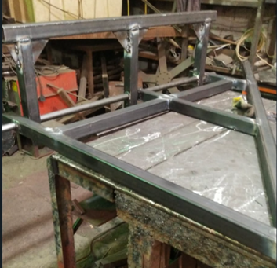
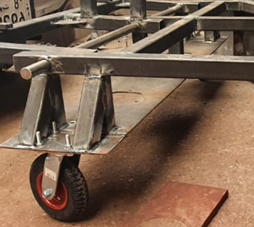
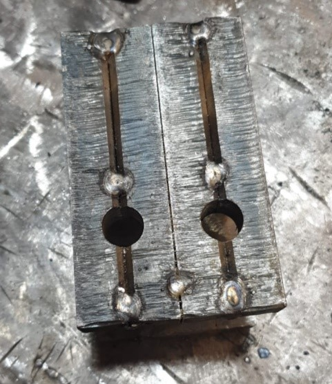
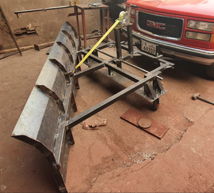

+++
title = "Manufacturing"
date = 2022-01-16T12:26:22+03:00
weight = 5
+++

It should be noted that not all the components that were desired from the concepts have been implemented into the prototype due to time constraints. The manufacturing was outsourced and done by BMB workshop in Shuwaikh due to the fact that the prototype required skilled labor to manufacture.
The available materials that were used for the prototype were:
#### •	AISI 1020
#### •	Hollow square tubes 5x5 [cm] with a thickness of 3[mm]
#### •	Solid Cylinder with a radius of 1.5 [cm]
#### •	Sheet metal with a thickness of 3 [mm]

The manufacturing started on the 28th of May. The prototype was categorized into four subassemblies; ready-made items; the plow; the frame; and finally, the car joints. This was done to allow for parts to be done in parallel.

## Ready Made Items 
There were four ready made items for the prototype:
##### •	The manual winch
##### •	The AC motors
##### •	The Tires
##### •	The Street brushes

#### The Frame
The frame was split into two components called the chassis and the motor cage. The chassis is the supporting part of the frame while the motor cage is as the name suggests a resting mount for the motors and brushes.

The chassis is composed of two main materials. The hollow square beams and the solid cylinder that allow for rotation. Relevant beams are first drilled using a drill bit for the cylinder to fit in the assembly of the component. Then the beams are joined together using welding and finally the cylinder is adjusted with a cylindrical metal bush in the joints. This allows for smoother rotation.

#### The Motor-Cage
The brushes are not able to reach the ground if attached straight at the chassis. Therefore, the motors should be mounted closer to the ground and that is the reason for the designing of the motor cage. A by product of this design is to also create a point of stable attachment for the tires. 

The cage was manufactured using the same beams for the chassis and were joined by welding as well. As for the motors, a sheet metal was used to have a place for mounting the motor in place. This sheet metal had been punched out using a punching machine to be able to mount the motors.

## The Plow
The metal is simply sheet metal that has been bended using a bending machine. With small sheet metal welded behind the plow for support.

A problem was encountered with manufacturing the plow subassembly. It was desired to implement a trip mechanism at the bottom of the plow which incorporates a trip spring system. However, due to complexity in the manufacturing and the lack of obtaining the correct springs for the applied force. It was not implemented into the subassembly.

## The Car Joints
The dimensions that were required were solid steel with a thickness of 5[cm]. the workshop available that could complete it in the appropriate time was a workshop that utilizes water jets for material removal processes. The problem that was encountered was that the machine could only cut a maximum of 2 [cm]. Therefore, through improvisation, the joints were cut as 4 pieces of 2[cm] thick car joints.

## The Assembly
After all the subassemblies were made and ready, all that was left was to assemble each of them and complete the manufacturing process. The motor cage, chassis and plow were all assembled by welding and the car joint was attached using bolts and pins.

