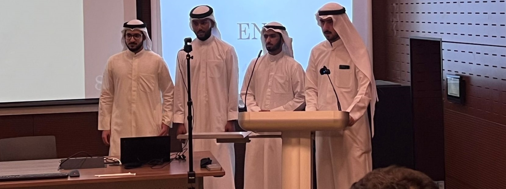

# **Sand sweeper**
____
By : 
 **Eng. Abdulaziz Al-Fouzan**/
<i class="fa-solid fa-gear"></i>
**Eng. Abdulaziz Al-Youhah**/
<i class="fa-solid fa-gear"></i>
**Eng. Abdulwahab Al-Bassam**/
<i class="fa-solid fa-gear"></i>
**Eng. Mosab Marafi**

___
### Abstract 
Sand accumulation on roads and streets is a significant problem facing Kuwait and the nearby countries. The sands impede the movement of vehicles and cause car accidents. Furthermore, it stands in the way of expanding and developing new cities and costs the country thousands of dinars every year. The team’s mission was to find a solution to this problem. An engineering design process was followed during a full academic semester. Starting with setting target specifications obtained from customer interviews and proceeding through concept development and system-level design, in which techniques such as concept scoring and concept screening were used. The design process ended with a detailed design in which CAD software packages were used to determine mechanical stress and specific dimensions for the product. A prototype was manufactured, however, some features were eliminated due to the limited time of the project. The prototype was tested after. The test was successful in most criteria despite having some issues with some features. Finally, an economic analysis was done to study the feasibility of the project from an economic point of view and the project was found to be feasible and profitable. 
___

[Final Report](files/Final%20Report%20459%20Group%20A.pdf)



___

### Project poster :

___

Contact us : SandSweeperKU@gmail.com

